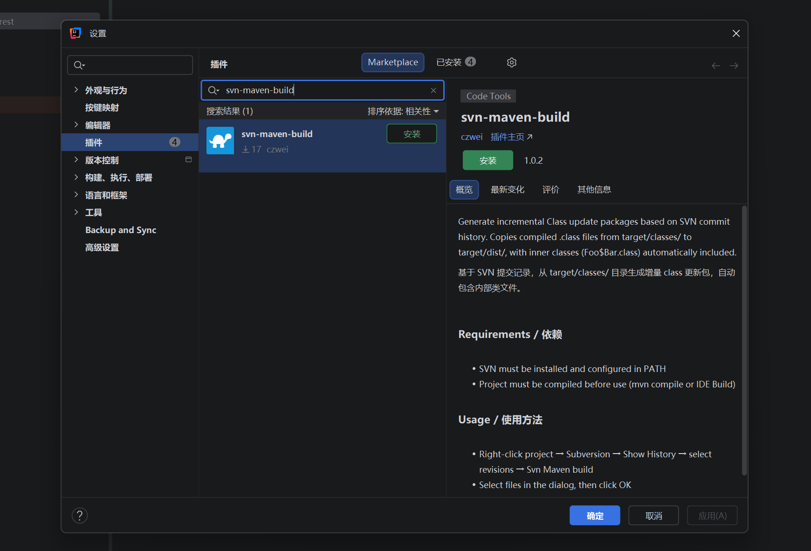
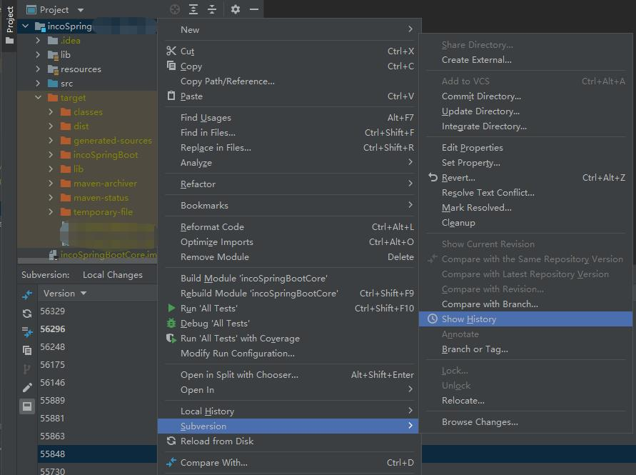
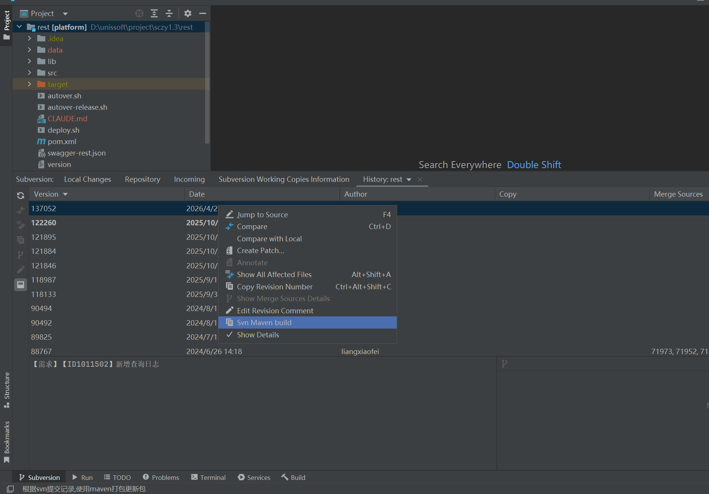
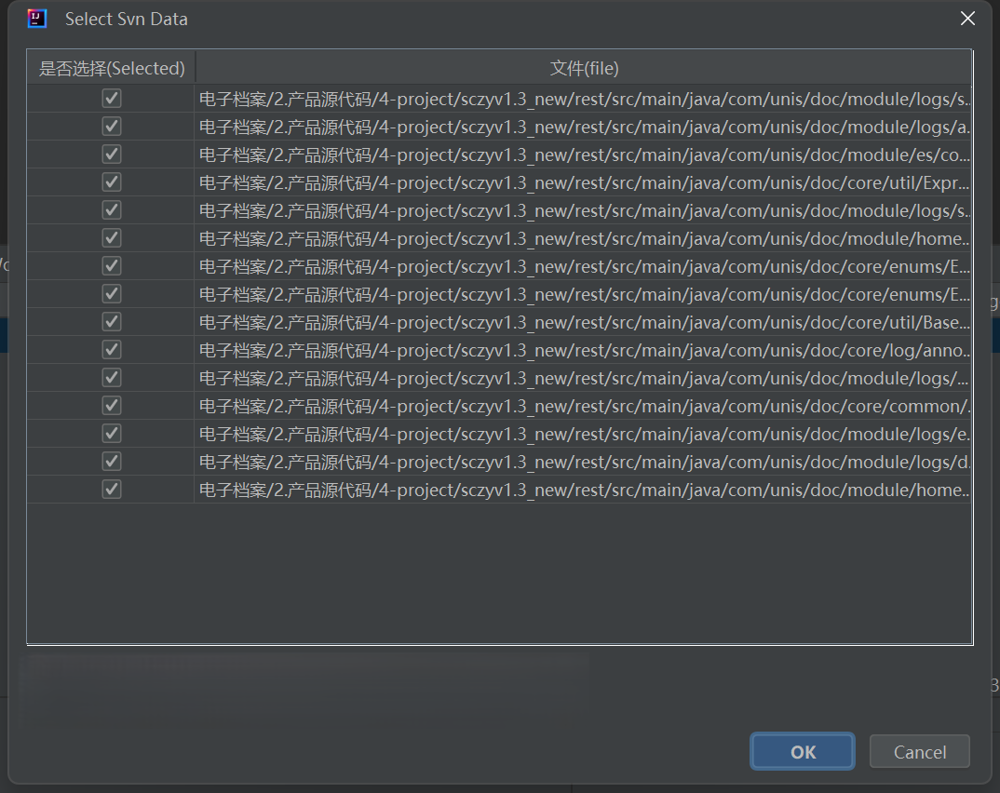
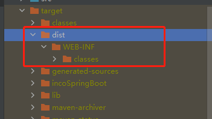
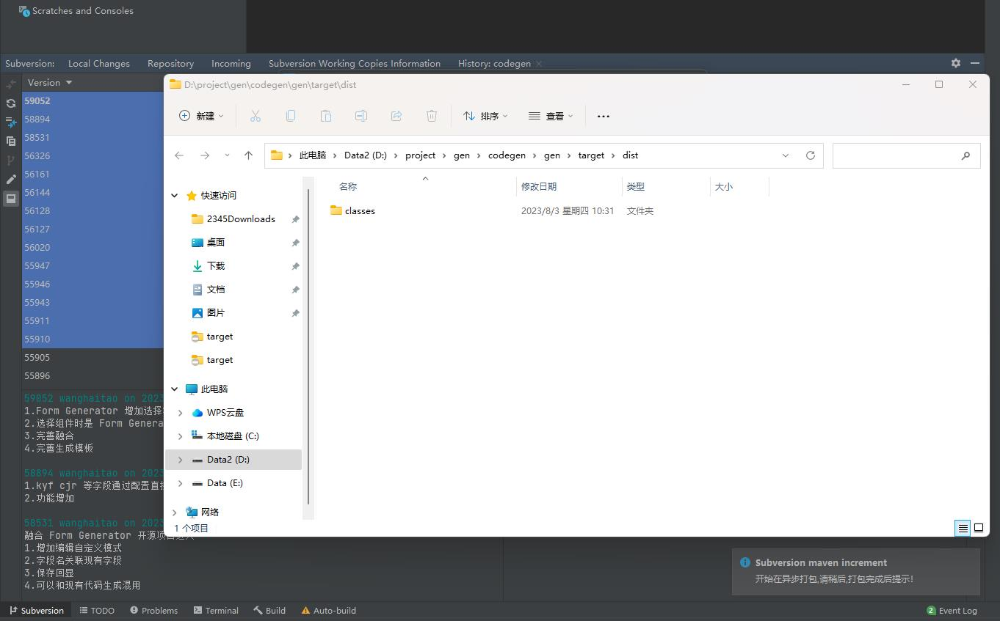
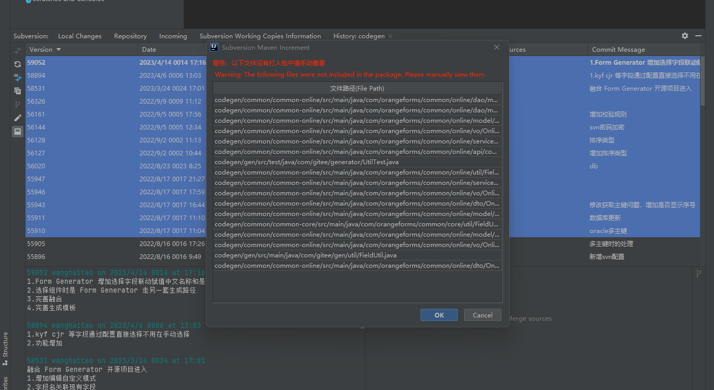

# Svn Maven Build

## 简介

Svn Maven Build是基于单体 maven+war 包项目，根据SVN提交记录打增量升级包

可以在idea商店搜索 **svn-maven-build** 下载

## 依赖

_**本插件需要依赖SVN**_

_**需要当前电脑安装了 SVN**_

## 提供的功能
_**1.可按批量选择的svn记录去重获取修改记录。**_

_**2.可根据svn记录从 target/classes 文件下按结构读取文件。（target/classes 有时候的文件有缓存，不一定是最新的这个需要注意）**_

_**3.同包下的内部类也会一并打入，防止更新上去代码出错。**_

_**4.如果有文件没有打入包中提示出来。**_

## 使用说明
点击 Subversion -> Show History -> Svn Maven Build
### 步骤1

### 步骤2

### 步骤3
点击 Svn Maven Build

会弹出选择svn数据生成的窗口，点击确定开始打包

说明：打包开始后会异步打包，打包完成后会提示打包完成，在 target/dist 文件夹下生成打包好的更新包，并自动打开打包好的文件夹

如果有文件没有打入包中提示出来

